This is exactly the right architectural instinct — separate the engine from the display. Let me read what you've already built before proposing anything.Good. The data shape is clear. Now I have everything I need.Now I have a clear picture of what exists. Let me draw the architecture before writing a word of prose.



Here's the directory structure and plan.

---

**Directory structure**

```
ukubona-twin/
│
├── engine/                         # pure Python, no HTTP
│   ├── __init__.py
│   ├── event_store.py              # NDJSONEventStore (already have)
│   ├── adversarial_perturbation.py # (already have)
│   ├── jacobian.py                 # (already have)
│   ├── full_epoch_simulation.py    # (already have)
│   ├── multi_epoch_training.py     # (already have)
│   └── simulator.py               # NEW: wraps the above into a clean
│                                   #   generate_event(agent, type) API
│                                   #   so real-world hooks call the same fn
│
├── api/                            # FastAPI
│   ├── __init__.py
│   ├── main.py                    # app entry, mounts routes
│   ├── routes/
│   │   ├── events.py              # POST /events  (ingest real or manual)
│   │   │                          # GET  /events/stream (SSE)
│   │   │                          # GET  /events/recent
│   │   ├── epoch.py               # POST /epoch/run
│   │   │                          # GET  /epoch/history
│   │   ├── jacobian.py            # GET  /jacobian/current
│   │   │                          # GET  /jacobian/layers
│   │   └── kingdomonic.py         # GET  /kingdomonic/scores
│   └── llm.py                     # OPTIONAL enrichment — feature-flagged
│                                   #   LLM_ENABLED=false → stub returns None
│
├── store/                          # data lives here, not in repo root
│   ├── twin_events.ndjson
│   ├── multi_epoch_training.ndjson
│   └── adversarial_events.ndjson
│
├── dashboard/                      # frontend
│   ├── index.html                 # your current standalone (always works)
│   └── react/                     # Vite/React (optional, richer)
│       ├── src/App.jsx
│       ├── vite.config.js
│       └── package.json
│
├── scripts/
│   ├── seed_store.py              # run once to populate store from scratch
│   └── replay_ndjson.py           # replay existing NDJSON as live events
│                                   #   (useful for demos — "time travel")
│
├── .env.example                   # LLM_ENABLED=false
│                                   # ANTHROPIC_API_KEY=
│                                   # STORE_DIR=./store
├── requirements.txt
└── README.md
```

---

**The three design decisions worth naming explicitly:**

**1. Engine is import-only.** `engine/` has zero HTTP. You can run `python -m engine.full_epoch_simulation` directly, call it from FastAPI, call it from a cron job, or call it from a test. No coupling to the web layer.

**2. Real-world and simulated events enter through the same door.** `POST /events` accepts any valid event JSON. A real field sensor and `simulator.py` both call the same endpoint. The store doesn't know the difference — that's the point. When a real truck sends telemetry, it lands in the same NDJSON as a simulated `supply_shock`. The dashboard surfaces both.

**3. LLM is a feature flag, not a dependency.** `api/llm.py` reads `LLM_ENABLED` from env. When false, `enrich_epoch(epoch_data)` returns `None` immediately. The epoch record is written to the store without a narrative field. When true, the same function calls the Anthropic API, appends `{"type": "llm_narrative", "epoch": N, "text": "..."}` to the store, and the dashboard surfaces it if present. Nothing breaks either way.

---

**Build order** — three sessions:

Session 1: `engine/simulator.py` + `store/` layout + `scripts/seed_store.py`. Verify the engine runs clean without any HTTP.

Session 2: `api/` — `main.py`, `events.py` (POST + SSE), `epoch.py`. Wire `engine/` as imports. Confirm `curl POST /events` writes to store and the SSE stream pushes it.

Session 3: `dashboard/index.html` polls the SSE stream. At this point you have a working end-to-end rehearsal pipeline. Add `api/llm.py` stub last.


- Large Data Source
- Combinatorial Explosion
- Epochal Curation
- Optimization Goal
- RLS/JWT Restricted Access Dashboard